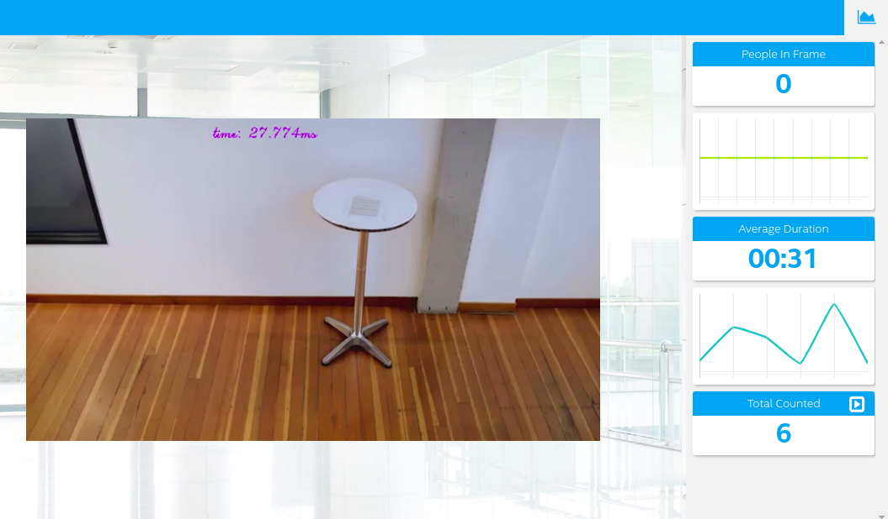

## Project Write-Up


### Explaining Custom Layers
What is a layer ? - Is the abstract concept of a math function that is selected for a specific purpose (examples: relu, sigmoid, tanh, convolutional). This is one of a sequential series of building blocks within the neural network. 

The Intel® Distribution of OpenVINO™ toolkit supports neural network model layers in multiple frameworks including TensorFlow*, Caffe*, MXNet*, Kaldi* and ONYX*. [Here the suported layers](https://docs.openvinotoolkit.org/latest/_docs_MO_DG_prepare_model_Supported_Frameworks_Layers.html) 
But what happens when there are layers that are not supported by the model optimizer? well in that case the model optimizer classifies them as custom layers. [Here](https://github.com/david-drew/OpenVINO-Custom-Layers/tree/master/2019.r2.0) is a tutorial on how to implement custom layers in openvino


### Explaining the app  

For this project look for the models from the openvino website, these models are not pre-optimized but are the tensorflow object detection API models [Frozen](https://docs.openvinotoolkit.org/latest/_docs_MO_DG_prepare_model_convert_model_Convert_Model_From_TensorFlow.html)

And the model that worked for me is the following : [ssd_mobilenet_v1_0.75_depth](http://download.tensorflow.org/models/object_detection/ssd_mobilenet_v1_0.75_depth_300x300_coco14_sync_2018_07_03.tar.gz) 

Steep 1 : download the model 

```
  wget http://download.tensorflow.org/models/object_detection/ssd_mobilenet_v1_0.75_depth_300x300_coco14_sync_2018_07_03.tar.gz

```

Steep 2 : unzip 

```
tar -xzvf ssd_mobilenet_v1_0.75_depth_300x300_coco14_sync_2018_07_03.tar.gz

```

Steep 3 : optimize to FP16

```
    python /opt/intel/openvino/deployment_tools/model_optimizer/mo.py --input_model ssd_mobilenet_v1_0.75_depth_300x300_coco14_sync_2018_07_03/frozen_inference_graph.pb --tensorflow_object_detection_api_pipeline_config ssd_mobilenet_v1_0.75_depth_300x300_coco14_sync_2018_07_03/pipeline.config --reverse_input_channels --tensorflow_use_custom_operations_config /opt/intel/openvino/deployment_tools/model_optimizer/extensions/front/tf/ssd_v2_support.json --data_type FP16
```

Steep 4 : Run the app

```
    python main.py -i resources/Pedestrian_Detect_2_1_1.mp4 -m ssd_mobilenet_v1_0.75_depth_300x300_coco14_sync_2018_07_03/frozen_inference_graph.xml -l /opt/intel/openvino/deployment_tools/inference_engine/lib/intel64/libcpu_extension_sse4.so -d CPU -pt 0.5 | ffmpeg -v warning -f rawvideo -pixel_format bgr24 -video_size 768x432 -framerate 24 -i - http://0.0.0.0:3004/fac.ffm

```




### Comparing Model Performance

In the [repository](https://github.com/tensorflow/models/blob/master/research/object_detection/g3doc/detection_model_zoo.md) of the models we can find the performance and what was the environment in which the inference was made to obtain that performance
The report running time in ms per 600x600 image (including all pre and post-processing) and the timings were performed using an Nvidia GeForce GTX TITAN X card. And the enviroment used for run the app (after optimizer) was the workspace of udacity 

```python
Before optimizer:

ssd_mobilenet_v1_0.75_depth ---> time : 26ms, size for .pb file = 18.5 MB 


After optimizer:

ssd_mobilenet_v1_0.75_depth ----> time : 27ms, size for .xlm file = 79.5 kB
                                                        .bin file = 8.2 MB

```                            
As we can see, the optimized model achieved a performance very close to that of the non-optimized model, with the conditions that the non-optimized model has a much larger size and was made using an Nvidia GeForce GTX TITAN X, so we can say that the optimization did not it only reduced the size but also had very close performance despite being run in a much more unfavorable environment

### Assess Model Use Cases

A use case for this type of applications can be counting people in a certain area, and putting together several cameras distributed by a city could tell us which are the areas with the highest population density in circulation, this can be useful in a scenario like the one you are living today with COVID19

### Assess Effects on End User Needs


Lighting, model accuracy, and camera focal length / image size have different effects on a
deployed edge model. Bad lighting can make the model's precision drop and make incorrect predictions in our edge app, the same thing happens when we want to identify people or objects in the dark.
A model with low precision will result in incorrect predictions, therefore the more precision is better.
The focal length is something important since when working in computer vision different curvatures present in the images can affect the performance of mostly models.
Image length and size are important for models that have a specific input type, because the mostly of models need a previus resize of the data imput 


### Model Research

Before getting the model that I use in my app, I tried 2 models whose results were not satisfactory

- First model: [ssd_mobilenet_v2_coco](http://download.tensorflow.org/models/object_detection/ssd_mobilenet_v2_coco_2018_03_29.tar.gz)

Optimization : 
```
  python /opt/intel/openvino/deployment_tools/model_optimizer/mo.py --input_model ssd_mobilenet_v2_coco_2018_03_29/frozen_inference_graph.pb --tensorflow_object_detection_api_pipeline_config ssd_mobilenet_v2_coco_2018_03_29/pipeline.config --reverse_input_channels --tensorflow_use_custom_operations_config /opt/intel/openvino/deployment_tools/model_optimizer/extensions/front/tf/ssd_v2_support.json
```
Perfomance : time : 68ms, people_counted: 7
 
I tried to improve the model for the app changing the prob_treshold to 0.9 and 0.4 but dont work


- Second model: [ssd_inception_v2_coco_2018_01_28](http://download.tensorflow.org/models/object_detection/ssd_inception_v2_coco_2018_01_28.tar.gz)
  
Optimization : 

```
  python /opt/intel/openvino/deployment_tools/model_optimizer/mo.py --input_model ssd_inception_v2_coco_2018_01_28/frozen_inference_graph.pb --tensorflow_object_detection_api_pipeline_config ssd_inception_v2_coco_2018_01_28/pipeline.config --reverse_input_channels --tensorflow_use_custom_operations_config /opt/intel/openvino/deployment_tools/model_optimizer/extensions/front/tf/ssd_v2_support.json

```
Perfomance : time : 154ms, people_counted: 8 

I tried to improve the model for the app changing the prob_treshold to 0.9 and 0.4 but dont work
